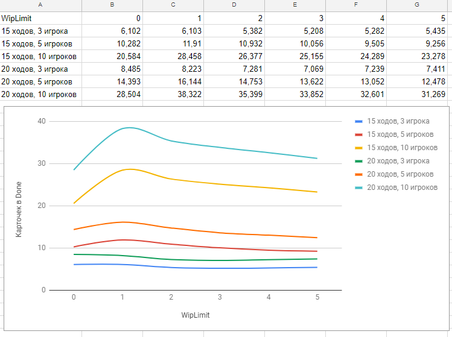

# featureban-statistics
Featureban Statistics - учебный проект по теме Domain Driven Development в рамках DodoDevSchool#4.

## Условия задания
Исследовать игру FeatureBan ([правила игры](https://www.dropbox.com/s/01mbav05k4bogen/featureban-slides-2.2-rus.pdf)) на зависимость пропускной способности доски от ограничения WIP.

Входные параметры:
* Количество игроков (3, 5, 10)
* Количество раундов в каждой игре (15, 20)
* Количество игр (1000)
* Ограничение WIP (нет ограничения, 1, 2, 3, 4, 5)

Выходное значение:
* Среднее количество карточек в колонке "Готово"

## Результаты

Таблица с полученными данными доступна по [ссылке](https://docs.google.com/spreadsheets/d/12t2HNCd5_-6VOfRBJ6Apxe8TzEFmKgQJVYcBH6L3taE/edit#gid=657673999)