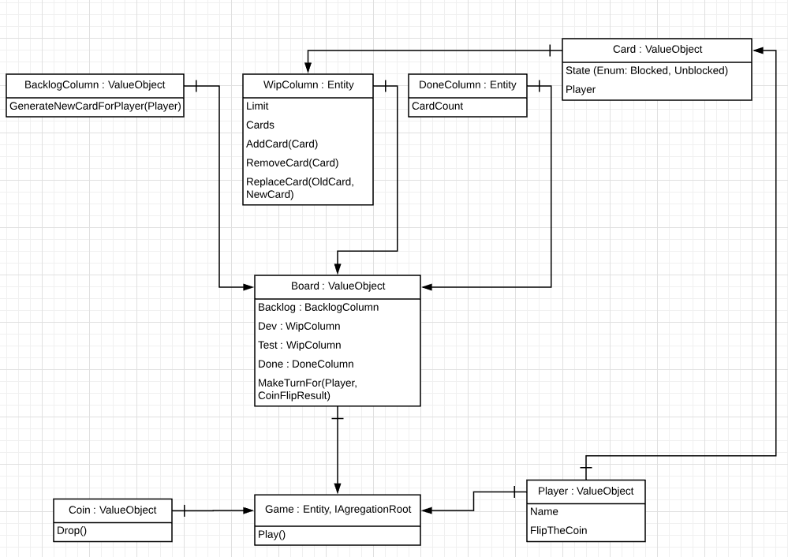

# featureban-statistics
Featureban Statistics - учебный проект по теме Domain Driven Development в рамках DodoDevSchool#4.

Авторы: Никита Стариченко (@wownetort), Михаил Кумачев (@ceridan)

## Условия задания
Исследовать игру FeatureBan ([правила игры](featureban-slides-2.2-rus.pdf)) на зависимость пропускной способности доски от ограничения WIP.

Входные параметры:
* Количество игроков (3, 5, 10)
* Количество раундов в каждой игре (15, 20)
* Количество игр (1000)
* Ограничение WIP (нет ограничения, 1, 2, 3, 4, 5)

Выходное значение:
* Среднее количество карточек в колонке "Готово"

## Архитектура решения

*Значение стрелок: A -> B означает, что сущность A передается сущности B как зависимость в конструкторе.
При этом Game является мета-объектом, который не зависит напрямую от Board и Player, а создает их на старте игры один раз и иницирует начало игры*

## Комментарии к решению
В рамках поставленной задачи по DDD мы решили не делать явные наследования от Entity или ValueObject, а использовать средства языка C#: class и struct соответственно. Логика в целом простая, если объект неизменяемый (immutable), в нашем случае например, Coin, то это ValueObject, в противном случае - Entity.

## Результаты

Таблица с полученными данными доступна по [ссылке](https://docs.google.com/spreadsheets/d/12t2HNCd5_-6VOfRBJ6Apxe8TzEFmKgQJVYcBH6L3taE/edit#gid=657673999)